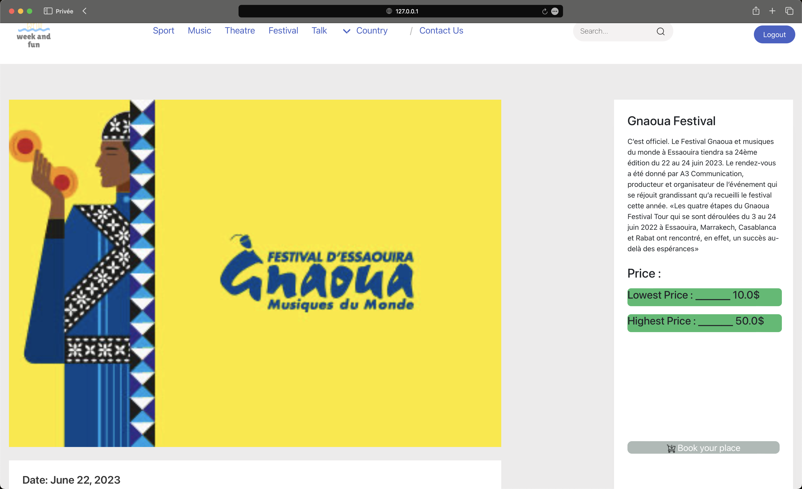
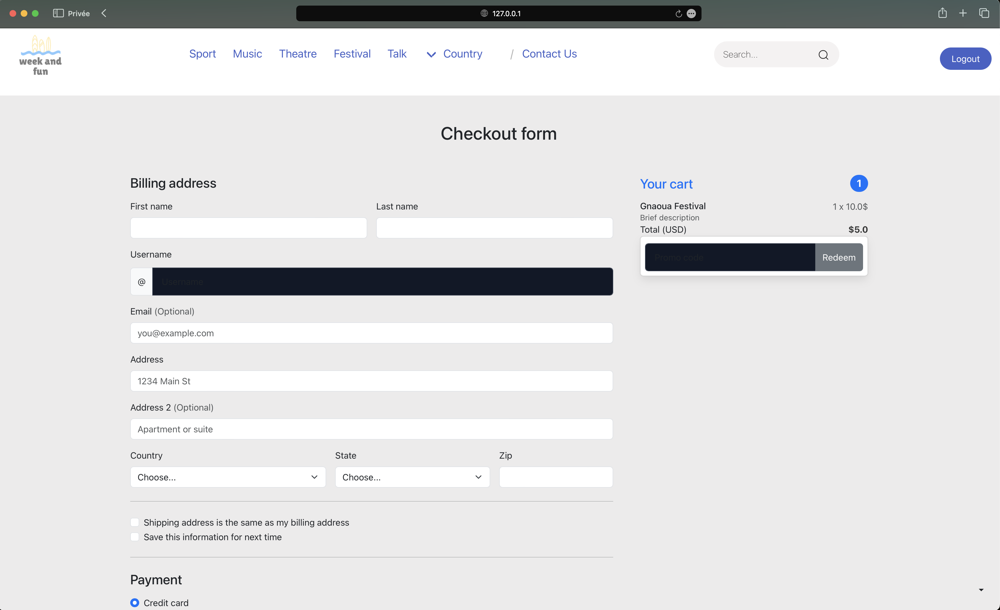

# WeekAndFun README.md

## Description
This project is a web application built using Django, consisting of two main parts: the account part and the store part. The account part includes user authentication, such as signup, login, and logout functionalities, along with a custom user model named `Customer`. The store part manages events, orders, and a shopping cart, allowing users to browse events, add them to the cart, and proceed to checkout.

## Account Part
### Models
- **Customer**
  - Extends Django's `AbstractUser` model.
  - Additional fields: `address`, `address2`, `country`, `state`, `zip_code`.

### Views
- **signup**
  - Allows users to register with a username and password.
  - Validates and creates a new user.
  - Logs in the user and redirects to the home page.

- **login_user**
  - Handles user login with username and password.
  - Redirects to the home page upon successful login.

- **logout_user**
  - Logs out the user and redirects to the home page.

## Store Part
### Models
- **Event**
  - Represents an event with various attributes such as `Name`, `Adresse`, `Lowest_Price`, `Highest_Price`, `Availibility`, `Description`, `Image`, `Category`, `Trending`, `Type`, etc.
  
- **Order**
  - Links a user to an event and tracks the quantity and order status.

- **Cart**
  - Associates a user with their order(s).

- **PromoCode**
  - Represents a promotional code with a code and discount.

### Views
- **index**
  - Displays a list of events on the home page.

- **events**
  - Displays a list of all events.

- **event_detail**
  - Displays detailed information about a specific event.

- **add_to_cart**
  - Adds an event to the user's shopping cart.

- **cart**
  - Displays the contents of the user's shopping cart.

- **delete_cart**
  - Deletes the user's shopping cart.

- **search_events**
  - Allows users to search for events by name.

- **category**
  - Displays events filtered by category.

- **country**
  - Displays events filtered by country.

- **checkout**
  - Handles the checkout process, including order summary and customer information form.

- **checkout_view**
  - Displays the checkout view with any available promotions.

- **update_quantity**
  - Handles updating the quantity of items in the shopping cart.

- **remove_from_cart**
  - Handles removing items from the shopping cart.

- **create_event**
  - Allows authenticated users to create new events.

- **send_order_confirmation_email**
  - Sends an order confirmation email to the customer.

### Templates
- Various HTML templates are used for rendering different pages.

### Forms
- **EventForm**
  - Form for creating events.

- **CustomerForm**
  - Form for capturing customer information during checkout.

### Email
- **send_order_confirmation_email**
  - Sends an order confirmation email to the customer.

##Demo
- **Home page**
  

- **Event page**
  

- **Checkout page**
  

## How to Run
1. Clone the repository: `git clone github.com/JsFn99/weekAndfun`
2. Install the required dependencies: `pip install -r requirements.txt`
3. Apply migrations: `python manage.py migrate`
4. Create a superuser account: `python manage.py createsuperuser`
5. Run the development server: `python manage.py runserver`

Visit `http://localhost:8000/` in your web browser to access the application.

## Additional Notes
- Make sure to customize the email settings in `settings.py` for proper email functionality.
- Ensure that the required Django and other dependencies are installed.
- Consider securing sensitive information such as secret keys and email credentials.

Feel free to reach out for any further assistance or improvements!
